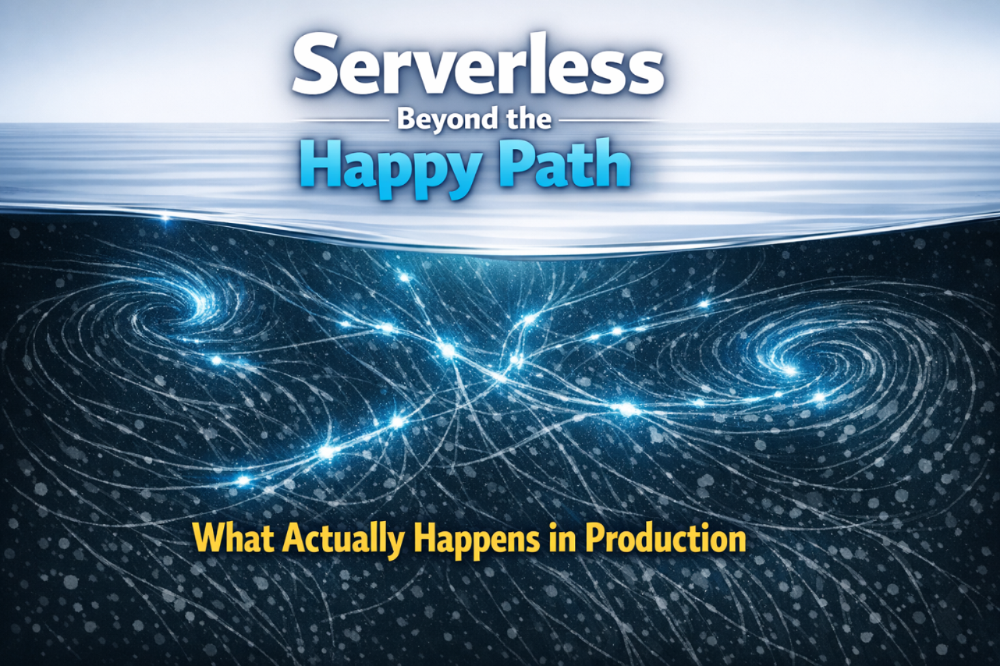

# Serverless Beyond the Happy Path: What Actually Happens in Production

 🗣️Talk 🟢 Advanced

## Abstract

Serverless platforms seem simple and scalable. But many teams find new problems after launch. Issues like retry storms, poison messages, cold starts, high costs, and fragile deployments can appear weeks or months later, often when traffic grows, or the original team is gone. These problems aren’t rare; they happen when only the ideal case is designed for.

This session examines what really happens when serverless systems run in production. It won’t cover services or frameworks. Instead, it examines how functions retry, overlap, repeat, and fail in real use. Attendees will learn why typical mental models fail, why idempotency requires a system-level focus, and how simple ideas about concurrency can lead to failures.

Next, the session links these systems' operation to real-world use. It explains how to use observability and cost information to see system behavior, not just errors. Attendees will learn how to find retry storms, poison messages, and cold-start problems before they cause trouble.

Finally, there is a live demo. It improves a serverless Function app that looks fine, but has hidden flaws. The session will cover patterns for handling failures, versioning, safe deployments, and ownership.

      

## Learning Objectives

- **Reason about serverless execution under real production conditions:** Understanding how retries, concurrency, and failure actually behave at runtime, and how to design idempotency and failure boundaries that hold up under load.
- **Operate serverless workloads using signals that reveal system behavior:** Instrumenting observability and cost data to detect retry storms, poison messages, cold‑start amplification, and runaway spend before they become incidents.
- **Evolve a working serverless application into a durable production system:** Applying concrete patterns for versioning, deployment, and ownership that survive real traffic, team turnover, and long‑term operation.

## Presentations

| Event | Location | Date | Time | Room | Downloads |
|-------|:--------:|-----:|-----:|-----:|----------:|
| [The Cloud & AI Summit 2026](https://www.cloudandaisummit.com/) | St. Louis | September 30 - October 2, 2026 | TBA | TBA | Available Afterwards |

## Resources
There are no additional resources for this presentation.

Email [chadgreen@chadgreen.com](mailto:chadgreen@chadgreen.com?subject=Presentation%20Request:%20Presentation%20Title) to have Chad present this session at your event.